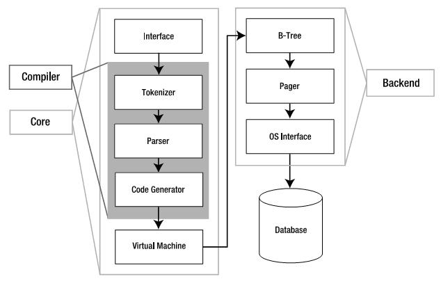
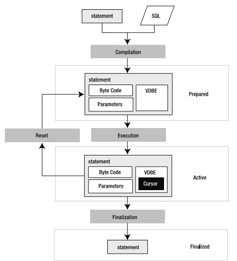

# SQLite 基本使用

## SQlite架构

### 接口
SQLite C API

### Compiler
编译器由 分词器、解析器、代码生成器组成

- Tokenizer 分词器，将SQL语句进行单词划分。
- Parser 解析器，将分词器结果进行语法解析，生成 AST 抽象语法树。
- Code generator 代码生成器，将 AST 生成字节码。

### Virtual Machine 
虚拟机，核心部分。也可以称为 虚拟数据库引擎（Virtual Database Engine，VDBE）
负责解析字节码

### Backend
- B-Tree B树，主要功能为索引，维护页面之间的关系
- Pager 页面缓存，通过OS接口在 B树和Disk 之间传递页面
- OS Interface 系统调用

## 概念

### 数据库的生命周期
- 连接数据库 `sqlite3_open()`
- 执行事务 
    - 默认情况下，事务自动提交，也就是每一个SQL语句都在一个独立的事务下运行。当然
    - 也可以通过使用BEGIN..COMMIT手动提交事务。
- 断开连接 `sqlite3_close();`

### connection 连接 
连接代表在一个数据库连接和一个事务上下文。

### statements
- 每一个 statement 都和一个 connection 关联，通常表示一个编译过的SQL语句
- statement 包括执行一个命令所需要的一切，包括VDBE程序执行所需的资源，指向硬盘记录的 B-树游标，以及参数等

### B-Tree B-树
- 一个connection可以有多个database对象，一个主要的数据库以及附加的数据库
- 每一个数据库对象有一个B-tree对象
- 一个B-tree有一个pager对象
- Statement最终都是通过connection的B-tree和pager从数据库读或者写数据，通过B-tree的游标(cursor)遍历存储在页面(page)中的记录
- B-tree和与之关联的游标就可以访问位于page中的记录了
- 总的来说，pager负责读写数据库，管理内存缓存和页面（page），以及管理事务，锁和崩溃恢复

### Pager
- 游标在访问页面之前要把数据从disk加载到内存
- 如果B-tree需要页面，它都会请求pager从disk读取数据
- 然后把页面(page)加载到页面缓冲区(page cache)

### SQL执行过程 sqlite prepare

- prepared query
    - 分析器（parser），分词器(tokenizer)和代码生成器(code generator)把SQL Statement编译成VDBE字节码，编译器会创建一个statement句柄(sqlite3_stmt)
    - `sqlite3_prepare()`
- execution
    - 虚拟机执行字节码，执行过程是一个步进(stepwise)的过程，每一步`step`由`sqlite3_step()`启动，并由VDBE执行一段字节码。在遍历结果集的过程中，它返回`SQLITE_ROW`，当到达结果末尾时，返回`SQLITE_DONE`。
    - `sqlite3_step()`
    - 查询 `select 操作` 时有数据返回
- finalization
    - VDBE关闭statement，释放资源。
    - `sqlite3_finalize()`

### 事务
- 生命周期
    - 与 Statement差不多，默认情况下事务自动提交，也可以手动提交（批量操作）
- 锁
    - 事务开始，加锁
    - 事务结束，释放锁
- 读事务
- 写事务

### 库 database
数据库

### 表 table

### 主键 primary key

### 字段 column

### 约束
比如创建表时指定字段 `NOT NULL`，表示该字段不能为空

### Schema
数据库的Metadata，包含表的完整信息。

### 增删查改

### 运算符 - 保留字/字符
- 算数运算符
- 比较运算符
- 逻辑运算符
- 位运算符

- WHERE
- AND
- OR

### 表达式
表达式是一个或多个值、运算符和计算值的SQL函数的组合。

##实际操作
## Database & Table

- 创建数据库 `create database dbname`
- 删除数据库 `drop database dbname`
- 创建表 `create table tbname if not exist ...`
- 删除表 `drop table tbname`

## 增删查改

- 增 `insert into tbname (field1, field2) values (value1, value2)`
- 删 
    - 删除所有数据 `delete from tbname`
    - 条件删除 `delete from tbname where ...`
- 查 
    - `select * from tbname` 查找所有
    - `select * from tbname where field=value` 条件查找
    - `select * from field like '%value%'` 模糊查找
- 改 `update tbname set field1=value1, field2=value2 where ...`
